# 囚徒健身修订版 - 项目文档

## 📋 目录

- [项目概述](#项目概述)
- [快速开始](#快速开始)
- [项目结构](#项目结构)
- [自动化工作流](#自动化工作流)
- [本地构建](#本地构建)
- [发布流程](#发布流程)
- [常见问题](#常见问题)

## 项目概述

本项目是对保罗·威德（Paul Wade）所著《囚徒健身》（Convict Conditioning）的科学性修订版本。使用 Gemini 3 AI 根据《囚徒健身》科学性修正与深度分析报告对原书进行系统性修订。

### 主要特性

- ✅ 基于现代运动科学的内容修正
- ✅ 自动化的电子书构建流程
- ✅ 支持多种格式（Markdown、EPUB、PDF）
- ✅ GitHub Actions 自动发布
- ✅ 版本控制和历史追踪

## 快速开始

### 1. 克隆仓库

```bash
git clone https://github.com/your-username/qiutu.git
cd qiutu
```

### 2. 查看修订内容

所有修订后的章节文件位于 `revised_book_v2/` 目录：

```bash
ls revised_book_v2/
```

### 3. 下载电子书

访问 [Releases](../../releases) 页面下载最新版本的电子书文件。

## 项目结构

```
qiutu/
├── .github/
│   └── workflows/
│       └── build_ebook.yml          # GitHub Actions 工作流配置
├── scripts/
│   ├── merge_chapters.py            # 章节合并脚本
│   └── build_ebook.py               # 电子书构建脚本
├── revised_book_v2/                 # 修订后的章节文件
│   ├── .gitignore
│   ├── 00_Title.md
│   ├── 01_Chapter1_The_Journey.md
│   ├── 02_Chapter2_Old_School.md
│   ├── 03_Chapter3_Manifesto.md
│   ├── 04_Chapter4_About.md
│   ├── 05_Chapter5_Pushups.md
│   ├── 06_Chapter6_Squats.md
│   ├── 07_Chapter7_Pullups.md
│   ├── 08_Chapter8_LegRaises.md
│   ├── 09_Chapter9_TheBridge.md
│   ├── 10_Chapter10_HandstandPushups.md
│   ├── 11_Chapter11_BodyWisdom.md
│   └── 12_Chapter12_Routines.md
├── 囚徒健身-保罗•威德.epub          # 原书电子书
├── 《囚徒健身》科学性修正与深度分析报告.md  # 修订依据
├── Convict_Conditioning_Revised_Complete.md   # 完整合并版（Markdown）
├── Convict_Conditioning_Revised_Complete.epub # 完整合并版（EPUB）
├── Convict_Conditioning_Revised_Complete.pdf  # 完整合并版（PDF）
├── .gitignore                       # Git 忽略文件配置
└── README.md                        # 项目说明文档
```

## 自动化工作流

### 触发条件

GitHub Actions 工作流会在以下情况自动触发：

1. **自动触发**：当 `revised_book_v2/` 目录下的任何 `.md` 文件被推送到 `main` 或 `master` 分支时
2. **手动触发**：在 GitHub Actions 页面手动运行工作流

### 工作流程

```mermaid
graph LR
    A[推送修订文件] --> B[检出代码]
    B --> C[安装依赖]
    C --> D[合并章节]
    D --> E[生成EPUB]
    E --> F[生成PDF]
    F --> G[提交到仓库]
    G --> H[创建Release]
    H --> I[上传电子书文件]
```



### 工作流步骤

1. **环境准备**
   - 检出代码
   - 设置 Python 3.11
   - 安装 Pandoc
   - 安装 Calibre

2. **构建过程**
   - 运行 `merge_chapters.py` 合并所有章节
   - 运行 `build_ebook.py` 生成 EPUB 和 PDF

3. **发布流程**
   - 提交生成的文件到仓库
   - 创建带日期标签的 Release
   - 上传 EPUB、PDF、Markdown 文件到 Release

### Release 命名规则

- **Tag**: `v2026.02.10` (格式: `v年.月.日`)
- **Release 名称**: `囚徒健身修订版 v2026.02.10`
- **文件名**: `囚徒健身修订版_2026-02-10.epub`

## 本地构建

### 环境要求

- Python 3.8+
- Pandoc 2.0+
- Calibre (可选，用于��成 PDF)

### 安装依赖

#### Windows

```powershell
# 安装 Python (如果未安装)
# 从 https://www.python.org/downloads/ 下载安装

# 安装 Pandoc
# 从 https://pandoc.org/installing.html 下载安装

# 安装 Calibre (可选)
# 从 https://calibre-ebook.com/download 下载安装
```

#### macOS

```bash
# 使用 Homebrew 安装
brew install python pandoc

# 安装 Calibre (可选)
brew install --cask calibre
```

#### Linux (Ubuntu/Debian)

```bash
# 安装依赖
sudo apt-get update
sudo apt-get install -y python3 pandoc calibre
```

### 构建步骤

#### 1. 合并章节

```bash
python scripts/merge_chapters.py
```

这将生成 `Convict_Conditioning_Revised_Complete.md`

#### 2. 生成电子书

```bash
python scripts/build_ebook.py
```

这将生成：
- `Convict_Conditioning_Revised_Complete.epub`
- `Convict_Conditioning_Revised_Complete.pdf` (如果安装了 Calibre)

### 脚本说明

#### merge_chapters.py

**功能**：按顺序合并 `revised_book_v2/` 目录下的所有 Markdown 文件

**输出**：`Convict_Conditioning_Revised_Complete.md`

**使用方法**：
```bash
python scripts/merge_chapters.py
```

#### build_ebook.py

**功能**：将合并后的 Markdown 文件转换为 EPUB 和 PDF 格式

**依赖**：
- Pandoc (必需，用于生成 EPUB)
- Calibre (可选，用于生成 PDF)

**使用方法**：
```bash
python scripts/build_ebook.py
```

## 发布流程

### 自动发布（推荐）

1. 修改 `revised_book_v2/` 目录下的任何章节文件
2. 提交并推送到 GitHub：
   ```bash
   git add revised_book_v2/
   git commit -m "更新第X章内容"
   git push origin main
   ```
3. GitHub Actions 自动构建并发布新版本
4. 在 Releases 页面查看和下载新版本

### 手动发布

1. 在本地构建电子书：
   ```bash
   python scripts/merge_chapters.py
   python scripts/build_ebook.py
   ```

2. 提交生成的文件：
   ```bash
   git add Convict_Conditioning_Revised_Complete.*
   git commit -m "手动更新电子书文件"
   git push origin main
   ```

3. 在 GitHub 上手动创建 Release 并上传文件

## 常见问题

### Q1: 如何修改某个章节的内容？

**A**: 直接编辑 `revised_book_v2/` 目录下对应的 Markdown 文件，然后推送到 GitHub。工作流会自动重新构建电子书。

### Q2: 为什么 PDF 生成失败？

**A**: PDF 生成需要安装 Calibre。如果未安装，工作流会跳过 PDF 生成步骤，但不会影响 EPUB 的生成。

### Q3: 如何自定义电子书元数据？

**A**: 编辑 `scripts/build_ebook.py` 文件中的 `metadata` 字典：

```python
metadata = {
    'title': '囚徒健身 - 科学修订版',
    'author': 'Paul Wade (科学修订版)',
    'lang': 'zh-CN',
    'date': datetime.now().strftime('%Y-%m-%d')
}
```

### Q4: 如何添加封面图片？

**A**: 
1. 在项目根目录添加 `cover.jpg` 文件
2. `build_ebook.py` 会自动检测并使用该封面

### Q5: 工作流运行失败怎么办？

**A**: 
1. 检查 GitHub Actions 页面的错误日志
2. 常见问题：
   - 权限不足：确保仓库设置中启用了 Actions 的写权限
   - 文件冲突：手动解决 Git 冲突后重新推送
   - 依赖安装失败：检查网络连接或依赖版本

### Q6: 如何禁用自动发布？

**A**: 删除或重命名 `.github/workflows/build_ebook.yml` 文件。

### Q7: 可以修改 Release 的命名格式吗？

**A**: 可以。编辑 `.github/workflows/build_ebook.yml` 文件中的相关步骤：

```yaml
- name: 获取当前日期和时间
  id: date
  run: |
    echo "version=v$(date +'%Y.%m.%d')" >> $GITHUB_OUTPUT
```

## 贡献指南

欢迎提交 Pull Request 来改进本项目！

### 贡献流程

1. Fork 本仓库
2. 创建特性分支：`git checkout -b feature/your-feature`
3. 提交更改：`git commit -am 'Add some feature'`
4. 推送到分支：`git push origin feature/your-feature`
5. 创建 Pull Request

### 代���规范

- Markdown 文件使用 UTF-8 编码
- Python 代码遵循 PEP 8 规范
- 提交信息使用中文，清晰描述更改内容

## 许可证

本项目采用 [CC BY-NC-SA 4.0](https://creativecommons.org/licenses/by-nc-sa/4.0/) 许可证。

## 联系方式

如有问题或建议，请通过以下方式联系：

- 提交 [Issue](../../issues)
- 发起 [Discussion](../../discussions)

---

**最后更新**: 2026-02-10
